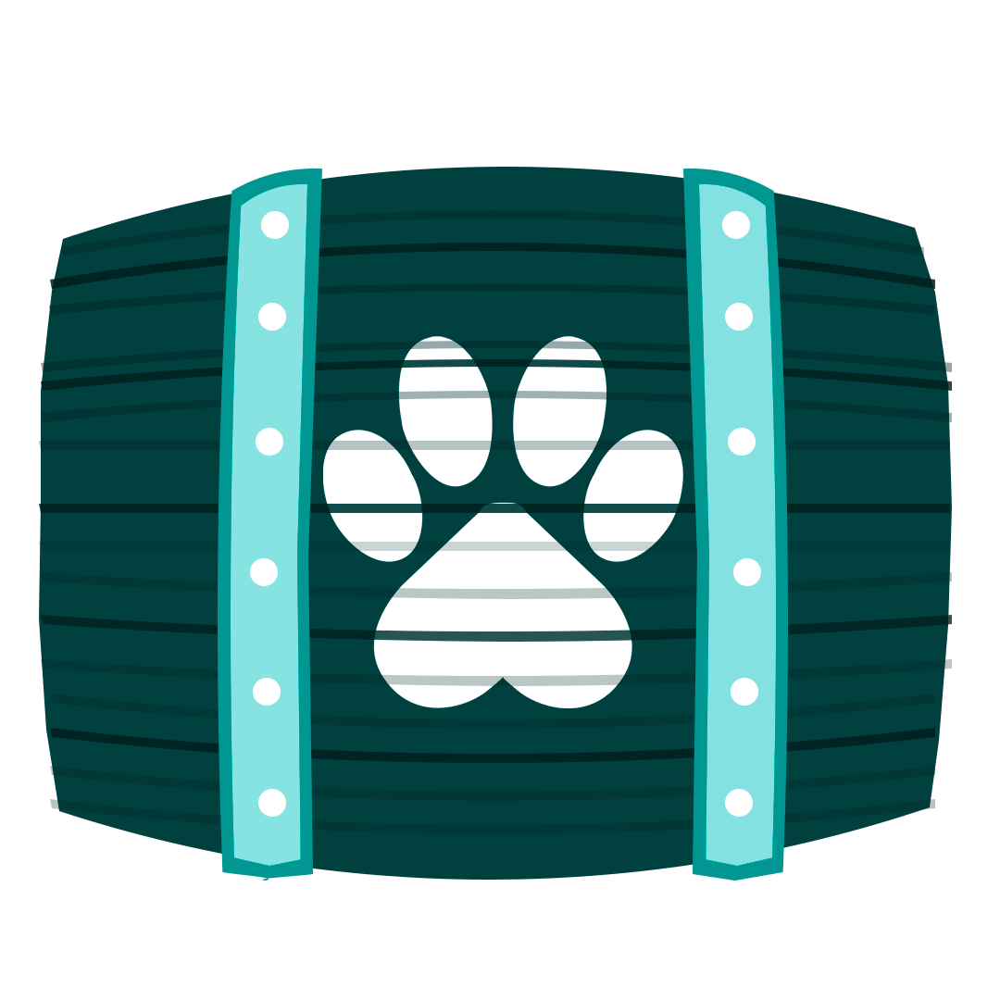

    

## PawTracker

The perfect tool for PAW to check $PAW transactions.

## What is Paw?

PAW is a animal themed digital currency. More information is available over on the official [Paw repository](https://github.com/paw-digital/paw-node).

| Link | Description |
| :----- | :------ |
[PAW.digital](https://paw.digital) | PAW digital currency Homepage

## Acknowledgements

Special thanks to the following!

- [My Nano Ninja](https://mynano.ninja/)
- [NanoCrawler](https://nanocrawler.cc/)
